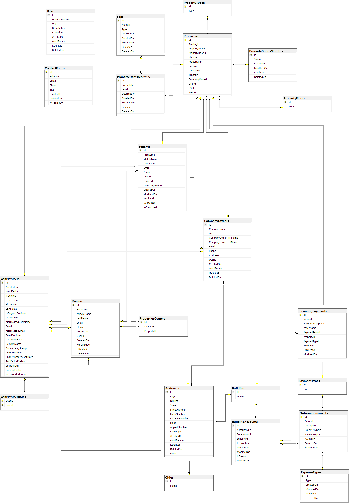

# BMS-BuildingManagementSystem

  **ASP .NET Core 5.0 Web Application Project** 

 ## C# Web Development Path at Software University, Bulgaria
------------

 **ABOUT my web project:**

------------
- *Building Management System (BMS) is an online platform for managing properies, located in a single block of flats. Some of the properties could be rented for long-term period.*

- *The platform meets owners, tenants and property manager needs for easy ant transperant management. Quite often, the owners don't live close to their properties. They could even live in another country. Managing their properties scattered everywhere, is a challenge.*

------------

## 🛠 **Database**
[Microsoft SQL Server](https://www.microsoft.com/en-us/sql-server/sql-server-downloads) along with [Entity Framework Core](https://dotnet.microsoft.com/download) were used to create and store the values. 
The database schema consists of the following main entities:

* Owners
* Company owners
* Tenants
* Properties
* Property types
* Addresses
* Cities
* Incoming payments
* Outgoing payments
* Building accounts
* Payments
* Expenses
* Application roles
* Contact form
* ###### Hangfire Database Schema inside the main production DB

#### **See the Database Schema below:**

   

## **Backend**
The web project contains:
* One Administration area
* 30+ service methods
* 7 controllers
* 20+ views

## **Technologies Used**

This website is designed and runs using the **main** technologies below:

   1) **[C#](https://en.wikipedia.org/wiki/C_Sharp_(programming_language))**
   2) **[ASP.NET Core](https://en.wikipedia.org/wiki/ASP.NET_Core)**
   3) **[Entity Framework Core](https://en.wikipedia.org/wiki/Entity_Framework?wprov=srpw1_0)**
   4) **[MS SQL Server](https://en.wikipedia.org/wiki/Microsoft_SQL_Server)**
   5) **[Bootstrap 4](https://getbootstrap.com/docs/4.0/getting-started/introduction/)**
   6) **[JavaScript](https://en.wikipedia.org/wiki/JavaScript)**
   7) **[HTML5](https://en.wikipedia.org/wiki/HTML)**
   8) **[CSS](https://www.w3schools.com/css/css_intro.asp)**
   9) **[MS Visual Studio 2019](https://code.visualstudio.com/)**
   10) **[MS SQL Server Management Studio](https://docs.microsoft.com/en-us/sql/ssms/download-sql-server-management-studio-ssms?view=sql-server-ver15)**
   11) **[Hangfire](https://www.hangfire.io/)**
   12) **[Google reCAPTCHA v3 API](https://developers.google.com/recaptcha/docs/v3)**
   13) **[Sendgrid API](https://sendgrid.com/docs/API_Reference/api_v3.html)**

## Admin Credentials:
- Email: admin@admin.com
- Password: admin123

## License
[MIT](https://choosealicense.com/licenses/mit/)

## Author
- [@IvayloFilipov](https://github.com/IvayloFilipov/BMS-BuildingManagementSystem)

## Template created by Nikolay Kostov
- *A ready-to-use template for ASP.NET Core with repositories, services, models mapping, DI and StyleCop warnings fixed.*

- (https://github.com/NikolayIT/ASP.NET-Core-Template)

------------
------------

#### This application has been created solely for educational purposes.

------------
